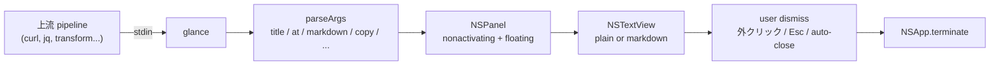

# glance


[](LICENSE)

[English](README.md) · **日本語**

**stdin で受け取った内容を non-activating な macOS NSPanel に表示する** one-shot
CLI。panel は元のアプリのキーボードフォーカスを奪わない — typing しながら
結果を眺められる。selection-driven pipeline の "結果表示" 端として使う。

```sh
some-cmd | glance --title "Result" --at 800 500
```

## 特徴

- **Non-activating panel**。`.nonactivatingPanel` + `becomesKeyOnlyIfNeeded`
  でフォーカスを奪わない (PopClip 風)
- **Markdown レンダリング** (`--markdown`, `NSAttributedString(markdown:)` 経由)
- **アンカー + サイズ指定** (`--at <x> <y>` は Cocoa 座標, `--width` / `--height`)
- **自動 close** (`--auto-close <秒>`)
- **ネットワーク呼び出しなし**。stdin だけ読む。HTTP は pipeline 上流の責務
- **Accessibility 権限不要**。AppKit + stdin のみ

## パイプライン構成

想定する組み合わせ:

```
selection trigger    →  action shell                 →  glance
─────────────────       ─────────────────────────       ─────────
eventfx (text_selected)  curl ... | jq -r .text |       NSPanel popover
PopClip extension                                       (フォーカス奪わない)
hotkey + script
```

glance は意図的に薄い: stdin in, panel out。翻訳・AI 呼び出し・辞書 lookup
等は全部 **action shell** (curl, jq, 自前 script) の仕事。

## アーキテクチャ



## 要件

- macOS 13 以降 (Ventura+)
- Xcode Command Line Tools (`swift`)
- 特別な権限不要

## インストール

Homebrew (準備中):

```sh
brew install akira-toriyama/tap/glance
```

ソースから:

```sh
git clone https://github.com/akira-toriyama/glance.git ~/dev/glance
cd ~/dev/glance
./install.sh   # → ~/.local/bin/glance
```

## CLI

```
some-cmd | glance [flags]

  --title <s>           ウィンドウタイトル
  --at <x> <y>          アンカー (Cocoa 座標, Y-up)。panel 左上端 = この座標。
                        指定無しなら画面中央。
  --markdown            stdin を Markdown としてレンダリング
  --auto-close <秒>     N 秒後に自動 close
  --width <px>          panel 幅 (デフォルト 380)
  --height <px>         panel 高さ (デフォルト 240)
  --version / -V        バージョン表示して exit
  --help / -h           ヘルプ表示して exit

Exit code:
  0   表示成功 (dismiss 後)
  2   引数エラー
```

## 使用例

```sh
# プレーンテキスト popover
printf 'Hello world' | glance --title 'Greeting'

# DeepL 翻訳パイプライン ($DEEPL_KEY 設定済前提)
printf '%s' "$SELECTION" |
  curl -s -X POST 'https://api-free.deepl.com/v2/translate' \
       -H "Authorization: DeepL-Auth-Key $DEEPL_KEY" \
       --data-urlencode "text@-" -d 'target_lang=JA' |
  jq -r '.translations[0].text' |
  glance --title 'DeepL' --at "$EVENTFX_CURSOR_X" "$EVENTFX_CURSOR_Y"

# AI 要約 + Markdown 表示
echo "$LONG_TEXT" |
  claude-cli "Summarize this in 3 bullets:" |
  glance --markdown --title 'Summary' --width 480

# 4 秒後に自動消滅
date | glance --auto-close 4 --title 'Now'
```

## Dismiss 経路

panel は次のいずれかで消える:

- panel 外をクリック (global mouse monitor)
- **Esc** キー (panel が transient に key になった時)
- 標準の close ボタン (赤丸) クリック
- `--auto-close N` のタイマー満了

## トラブルシュート

- **panel が出ない**: `./bin/glance --version` でビルド確認 → 空でない text を
  pipe。空 stdin は意図的に no-op (静かに exit 0)。
- **フォーカスを奪う**: 設計上起きないはず (`.nonactivatingPanel`)。起きたら
  再現手順付きで bug report。
- **Markdown のレンダリングが変**: `NSAttributedString(markdown:)` は inline
  syntax preserving whitespace 対応。ブロックレベル (#, ``` , >) は簡略化。
  リッチな出力が欲しい場合は上流で HTML / plain text に整形して pipe。

## 開発

```sh
./build.sh                 # swift build + codesign + bin/ に配置
./run.sh                   # build + ~/.local/bin に install
./run.sh --demo            # build + smoke test (printf | ./bin/glance)
./stop.sh                  # 残った glance panel を強制停止 (稀)
./setup-signing-cert.sh    # 初回のみ: 持続自己署名 identity を作成
./scripts/build-icon.sh    # AppIcon.icns を SF Symbol から再生成
swift test                 # XCTest 実行 (GlanceCoreTests)
```

- SwiftPM プロジェクト。ヘキサゴナル 3 層:
  `Sources/GlanceCore` (純粋ロジック) /
  `Sources/GlanceAdapterMacOS` (AppKit) /
  `Sources/GlanceApp` (CLI + @main)
- 推奨コミット規約: gitmoji + Conventional Commits (`scripts/hooks/commit-msg`
  で検証。有効化: `git config core.hooksPath scripts/hooks`)
- リリース: `release.yml` が rolling draft を生成。GitHub UI で Publish →
  `update-tap.yml` が tap formula を自動 bump

## ライセンス

[MIT](LICENSE) © 2026 akira-toriyama
