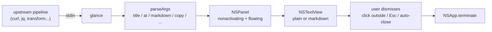

# glance


[](LICENSE)

**English** · [日本語](README.ja.md)

A macOS one-shot CLI that **displays stdin in a non-activating NSPanel**.
The panel does NOT steal keyboard focus from the source app — you can keep
typing while the result is visible. Use as the result-display end of
selection-driven pipelines.

```sh
some-cmd | glance --title "Result" --at 800 500
```

## Highlights

- **Non-activating panel.** `.nonactivatingPanel` + `becomesKeyOnlyIfNeeded`
  → source app keeps keyboard focus (PopClip-style)
- **Solid VSCode-like dark theme** (`#1E1E1E`) with forced `darkAqua`
  appearance for predictable contrast
- **Full GFM Markdown** with `--markdown`: headings, bold/italic,
  inline & block code, blockquote (left bar), lists, **tables**,
  **task lists** (`- [x]`), **strikethrough**, links — via Apple's
  [swift-markdown](https://github.com/swiftlang/swift-markdown)
- **Syntax highlighting** in code blocks via
  [Highlightr](https://github.com/raspu/Highlightr) (highlight.js +
  JavaScriptCore). Language hint from the fence (` ```swift `) drives
  the lexer; no-hint blocks stay plain
- **VSCode-style language label** in the top-right corner of each
  fenced code block
- **Anchor + sizing** via `--at <x> <y>` (Cocoa coords) + `--width` /
  `--height`. Anchors are auto-clamped to `visibleFrame`
- **Auto-size height** to content (clamped 80–600pt) when `--height`
  is omitted
- **Fade in / out** (~0.14s) matching macOS notification timing
- **Copy on display** via `--copy` (`pbcopy` the stdin alongside the
  panel)
- **HUD mode** via `--hud` (borderless rounded panel, ideal for short
  toast-style notifications)
- **Tunable typography** via `--font-size <pt>` (markdown headings scale
  relative to this)
- **Tunable code theme** via `--theme <name>` (any highlight.js theme
  bundled with Highlightr; default `atom-one-dark`)
- **Skip syntax highlight** via `--no-highlight` (faster start, plain
  monospace code blocks)
- **Auto-close** via `--auto-close <seconds>`
- **No network**. Reads stdin only; upstream pipeline does the fetching
- **No Accessibility permission**. Just AppKit / stdin

## Pipeline

The intended composition:

```
selection trigger    →  action shell                 →  glance
─────────────────       ─────────────────────────       ─────────
eventfx (text_selected)  curl ... | jq -r .text |       NSPanel popover
PopClip extension                                       (no focus capture)
hotkey + script
```

glance is intentionally thin: stdin in, panel out. Translation, AI calls,
dictionary lookup etc. live in the action shell (curl, jq, your scripts).

## Architecture



## Requirements

- macOS 13+ (Ventura)
- Xcode Command Line Tools (`swift`)
- No special permissions

## Install

Homebrew (planned):

```sh
brew install akira-toriyama/tap/glance
```

Or from source:

```sh
git clone https://github.com/akira-toriyama/glance.git ~/dev/glance
cd ~/dev/glance
./install.sh   # → ~/.local/bin/glance
```

## CLI

```
some-cmd | glance [flags]

  --title <s>           window title
  --at <x> <y>          anchor (Cocoa screen coords, Y-up).
                        Panel top-left = this point. Default: screen
                        center. Clamped to visibleFrame so the panel
                        never falls off-screen.
  --markdown            render stdin as Markdown (CommonMark + GFM)
  --copy                also copy stdin to clipboard (pbcopy)
  --auto-close <s>      dismiss after N seconds
  --width <px>          panel width  (default 380)
  --height <px>         panel height (default: auto-size, clamped 80–600)
  --font-size <pt>      body font size (default 16; markdown headings
                        scale relative to this)
  --theme <name>        Highlightr theme for code blocks (default
                        atom-one-dark). Try: nord, monokai-sublime,
                        vs2015, github-dark, etc.
  --no-highlight        skip syntax highlighting entirely (faster start,
                        no JSCore boot)
  --hud                 borderless rounded-corner mode for short
                        toast-style display (no title bar)
  --version / -V        print version, exit
  --help / -h           print help, exit

Exit codes:
  0   shown successfully (after dismissal)
  2   bad flag / parse error
```

## Examples

```sh
# plain text popover
printf 'Hello world' | glance --title 'Greeting'

# DeepL pipeline (assumes $DEEPL_KEY)
printf '%s' "$SELECTION" |
  curl -s -X POST 'https://api-free.deepl.com/v2/translate' \
       -H "Authorization: DeepL-Auth-Key $DEEPL_KEY" \
       --data-urlencode "text@-" -d 'target_lang=JA' |
  jq -r '.translations[0].text' |
  glance --title 'DeepL' --at "$EVENTFX_CURSOR_X" "$EVENTFX_CURSOR_Y"

# AI summary with markdown
echo "$LONG_TEXT" |
  claude-cli "Summarize this in 3 bullets:" |
  glance --markdown --title 'Summary' --width 480

# Auto-close after 4s
date | glance --auto-close 4 --title 'Now'
```

## Dismiss behaviors

The panel goes away when:

- You click outside (global mouse monitor catches it)
- You press **Esc** or **⌘W** (when the panel transiently became key)
- The standard close button (red dot) is clicked
- `--auto-close N` timer expires

## Troubleshooting

- **Panel doesn't appear**: check `./bin/glance --version` builds & runs, then
  pipe non-empty text. Empty stdin is a deliberate no-op.
- **Panel steals focus**: shouldn't happen by design (`.nonactivatingPanel`).
  If it does, file a bug with reproduction.
- **Markdown looks plain (no highlight)**: language-less fenced blocks
  (` ``` ` with no `swift` / `python` / etc) stay plain mono by design.
  Add a fence language hint to opt into syntax highlight.
- **Long code line doesn't wrap nicely**: code blocks wrap at the
  character (not word) boundary, which is intentional — code rarely has
  meaningful word boundaries. If you want no wrap, pre-format upstream.
- **Highlightr first call is slow**: the JavaScriptCore context warms
  up on the first highlighted block (~30–100ms). Subsequent blocks in
  the same process are instant.

## Development

```sh
./build.sh                 # swift build + codesign + cp to bin/
./run.sh                   # build + install to ~/.local/bin
./run.sh --demo            # build + smoke test (printf | ./bin/glance)
./stop.sh                  # kill any stuck glance panels (rare)
./setup-signing-cert.sh    # one-time: persistent self-signed identity
./scripts/build-icon.sh    # regenerate AppIcon.icns
swift test                 # run XCTest suite (GlanceCoreTests)
```

- SwiftPM project, hexagonal 3-layer:
  `Sources/GlanceCore` (pure logic, Foundation only) /
  `Sources/GlanceAdapterMacOS` (AppKit + markdown rendering /
  syntax highlight) /
  `Sources/GlanceApp` (CLI + @main)
- Dependencies (SwiftPM, MIT / Apache-2 compatible only):
  - [swift-markdown](https://github.com/swiftlang/swift-markdown)
    (Apache-2) — CommonMark + GFM parser
  - [Highlightr](https://github.com/raspu/Highlightr)
    (MIT) — highlight.js + JavaScriptCore wrapper
- Suggested commit convention: gitmoji + Conventional Commits
  (`scripts/hooks/commit-msg` validates; enable with
  `git config core.hooksPath scripts/hooks`)
- Release: `release.yml` → rolling draft. Publish in GitHub UI →
  `update-tap.yml` bumps tap formula automatically

## License

[MIT](LICENSE) © 2026 akira-toriyama
