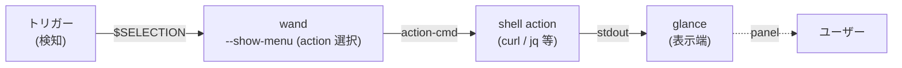
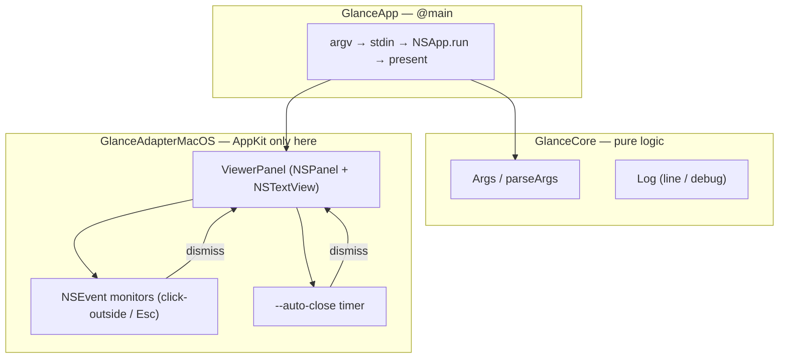

# 用語集 — glance のユビキタス言語

glance を構成する各パーツの **正規の呼び名** をまとめた規範ドキュメント。
**コード・ドキュメント・コミットメッセージ・PR タイトル・Claude Code への
プロンプト、すべてここに載っている名前のみを使う**。同義語は揺らぎを生む。
1 つに決めて、それで通す。

なお **正規名は英語のまま** 保持する。コード識別子・CLI フラグ・環境変数
（`ViewerPanel`, `--auto-close`, `GLANCE_DEBUG` など）と一対一に対応
させるため。日本語化するのは説明文だけ。

用語が足りなければ、その用語を導入する PR で同時にこのファイルへ追記する。
用語名を変える場合は、コード・ドキュメント・このファイルを **同一 PR で**
書き換える。

> 各エントリの形式: **正規名**, 1〜2 行の定義, 設定 / コードでの所在,
> そして `Don't call it:` 行 — このエントリが置き換える誤った呼び名のリスト。

---

## glance の立ち位置

glance は **pipeline の "結果表示端"**。連携の典型形は以下:

下の図は glance プロセス内の構造（3 層 + lifecycle / dismiss 経路）。

---

## レイヤー / モジュール

### GlanceCore
**純ロジック層**。`Args` / `parseArgs` / `Log` などが住む。Foundation のみ。
AppKit は含めない。XCTest で単体検証できる範囲。
- 場所: [`Sources/GlanceCore/`](../Sources/GlanceCore/)
- **Don't call it:** parser module, domain layer, ドメイン層

### GlanceAdapterMacOS
**AppKit 層**。`ViewerPanel`（NSPanel 生成 + NSTextView マウント）と
`NSEvent` monitor（click-outside / Esc）でのみ AppKit / Cocoa を使う。
- 場所: [`Sources/GlanceAdapterMacOS/`](../Sources/GlanceAdapterMacOS/)
- **Don't call it:** ui module, view layer, GUI 層

### GlanceApp
`@main` エントリ。argv 解析 → stdin 読み → `NSApp.run()` →
`ViewerPanel.present` という lifecycle のみを担う。
- 場所: [`Sources/GlanceApp/`](../Sources/GlanceApp/)
- **Don't call it:** main module, entry, エントリーポイント

---

## UI / 表示

### ViewerPanel
glance の **唯一の UI surface**。`NSPanel` に `.nonactivatingPanel` style mask
+ `becomesKeyOnlyIfNeeded` で **元アプリのフォーカスを奪わない** panel
（ツールバー風で、ソースアプリのフォーカスを保つ UX）。
- コード: [`Sources/GlanceAdapterMacOS/ViewerPanel.swift`](../Sources/GlanceAdapterMacOS/ViewerPanel.swift)
- **Don't call it:** modal, popup, window, dialog, viewer window,
  モーダル, ポップアップ, ダイアログ, ウィンドウ

### non-activating panel
`ViewerPanel` の振る舞いの根幹。**フォーカスを奪わない** ことを指す
正規名。`.nonactivatingPanel` style mask + `becomesKeyOnlyIfNeeded` +
`orderFrontRegardless()` の組合せで実現（`makeKey()` しない）。
- **Don't call it:** floating window, tool window, hud, フロートウィンドウ

### markdown rendering
`--markdown` 指定時の表示処理。`NSAttributedString(markdown:options:)`
を使い、失敗時は **plain text に fallback**。`labelColor` で上書きしてダーク
モードに追従。
- **Don't call it:** rich text, html render, リッチテキスト

### dismiss paths
panel が閉じる **4 経路**:
(1) panel 外クリック（global mouse monitor）/
(2) Esc（panel が transient に key になった時の local key monitor）/
(3) `--auto-close N` の N 秒タイマー /
(4) 標準の panel close ボタン。
- **Don't call it:** close routes, exit paths, 終了経路（パイプライン全体の
  exit と紛らわしいため）

---

## CLI / 入出力

### stdin pipeline
glance の **唯一の入力経路**。HTTP 呼び出し等は **上流の責務** で、glance は
受け取った文字列を表示するだけ。空 stdin は **no-op**（静かに exit 0、
空 panel を出さない）。
- **Don't call it:** input, source, data feed, 入力データ

### `--auto-close`
`<seconds>` 後に panel を自動 dismiss させる CLI フラグ。0 / 未指定なら
タイマーなし。
- **Don't call it:** ttl, timeout, auto-dismiss, 自動消滅

### `--at <x> <y>`
panel の top-left anchor を **Cocoa 座標**（Y-up、全スクリーン）で指定する
フラグ。トリガー（chord のホットキーやテキスト選択監視など）が渡す座標と
直接整合する
（wand `stroke --show-menu --at` 契約と同形）。
- **Don't call it:** position, location, coords, 座標指定（フラグ名固定）

### one-shot CLI
glance のライフサイクル契約。**1 プロセス = 1 panel**、stdin 読み終わったら
`NSApp.run()` → user dismiss → `NSApp.terminate(nil)` → プロセス終了。常駐
しない / 多 panel を持たない。
- **Don't call it:** daemon, server, persistent process, デーモン, 常駐

---

## デバッグ / ログ

### `GLANCE_DEBUG`
**verbose の唯一のトリガ**。環境変数として `1` を立てると `/tmp/glance.log`
への trace + stderr ミラーが有効になる。**`--debug` フラグは存在しない**
（facet / chord / wand / perch 家系と統一）。
- **Don't call it:** --debug, --verbose, ログモード

### `/tmp/glance.log`
`GLANCE_DEBUG=1` 時の verbose trace 出力先（引数 / stdin サイズ / panel frame /
dismiss 等）。通常運転中は **黙る**（"Result が出ない" のなら上流 pipeline を
疑う）。
- **Don't call it:** debug log, trace file, トレースログ

### `Log.line` / `Log.debug`
`GlanceCore` の 2 関数。`Log.line` は常時 ON、`Log.debug` は `GLANCE_DEBUG`
gate。家風と同形（facet / wand / perch と揃える）。
- **Don't call it:** info / verbose / 通常ログ

---

## エントリ追加時のルール

- 1 つの概念につき正規名は 1 つ。複数の呼び方が流通しているなら、
  このファイルで勝者を選び、敗者は `Don't call it:` 行に並べる。
- 正規名は **英語のまま** 書く。CLI フラグ（`--auto-close`, `--at`,
  `--markdown`）はその表記を維持する。
- 定義は **1〜2 文** に収める。動作の詳細は設定セクションやソース
  ファイルへリンクし、ここで説明し直さない。
- pipeline で連携する他リポジトリ（wand など）の用語と衝突しないか
  確認する。衝突する場合は **glance 側で別名を取る** か `Don't call it:`
  に並べて棲み分けを明記する。
