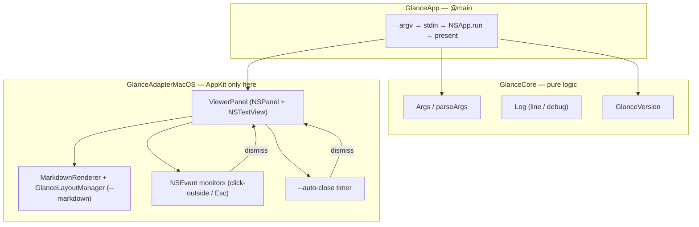

# Glossary — glance's ubiquitous language

The normative document collecting the **canonical names** of every part of
glance. **Code, documentation, commit messages, PR titles, and prompts to
Claude Code use only the names listed here.** Synonyms breed drift: pick
one name, use it everywhere.

Canonical names stay **in English**, 1:1 with code identifiers, CLI flags,
and environment variables (`ViewerPanel`, `--auto-close`, `GLANCE_DEBUG`,
…).

When a term is missing, add it to this file in the same PR that introduces
it. When renaming a term, rewrite code, docs, and this file **in one PR**.

> Entry format: **canonical name**, a 1-2 line definition, where it lives
> in config / code, and a `Don't call it:` line — the list of wrong names
> this entry replaces.

---

## Where glance sits

glance is **the pipeline's "result display end"**: trigger → wand → shell
action → glance. The chain is drawn once, in
[README § Pipeline](../README.md#pipeline).

The diagram below is the structure inside the glance process (3 layers +
lifecycle / dismiss paths).

```mermaid
flowchart TB
  subgraph CORE["GlanceCore — pure logic"]
    ARGS["Args / parseArgs"]
    LOG["Log (line / debug)"]
    VERSION["GlanceVersion"]
  end
  subgraph ADAPTER["GlanceAdapterMacOS — AppKit only here"]
    PANEL["ViewerPanel (NSPanel + NSTextView)"]
    RENDER["MarkdownRenderer + GlanceLayoutManager (--markdown)"]
    MON["NSEvent monitors (click-outside / Esc)"]
    TIMER["--auto-close timer"]
  end
  subgraph APP["GlanceApp — @main"]
    MAIN["argv → stdin → NSApp.run → present"]
  end
  MAIN --> ARGS
  MAIN --> VERSION
  MAIN --> PANEL
  PANEL --> RENDER
  PANEL --> MON
  PANEL --> TIMER
  MON -->|dismiss| PANEL
  TIMER -->|dismiss| PANEL
```

---

## Layers / modules

### GlanceCore
The **pure-logic layer**. `Args` / `parseArgs` / `Log` / `GlanceVersion`
live here. Foundation only — no AppKit. The unit-testable range under
XCTest.
- Location: [`Sources/GlanceCore/`](../Sources/GlanceCore/)
- **Don't call it:** parser module, domain layer

### GlanceAdapterMacOS
The **AppKit layer** — the only target that imports AppKit: `ViewerPanel`
(NSPanel creation + NSTextView mounting + the `NSEvent` monitors for
click-outside / Esc), `MarkdownRenderer` (see markdown rendering) and
`GlanceLayoutManager` (the inline-code pill drawing).
- Location: [`Sources/GlanceAdapterMacOS/`](../Sources/GlanceAdapterMacOS/)
- **Don't call it:** ui module, view layer

### GlanceApp
The `@main` entry. Owns only the lifecycle: parse argv → read stdin →
`NSApp.run()` → `ViewerPanel.present`.
- Location: [`Sources/GlanceApp/`](../Sources/GlanceApp/)
- **Don't call it:** main module, entry

---

## UI / display

### ViewerPanel
glance's **sole UI surface**. An `NSPanel` with the `.nonactivatingPanel`
style mask + `becomesKeyOnlyIfNeeded` — a panel that **never steals the
source app's focus** (toolbar-like UX preserving the source app's focus).
- Code: [`Sources/GlanceAdapterMacOS/ViewerPanel.swift`](../Sources/GlanceAdapterMacOS/ViewerPanel.swift)
- **Don't call it:** modal, popup, window, dialog, viewer window

### non-activating panel
The root of `ViewerPanel`'s behavior — the canonical name for **never
stealing focus**. Achieved by the combination of the `.nonactivatingPanel`
style mask + `becomesKeyOnlyIfNeeded` + `orderFrontRegardless()` (never
`makeKey()`).
- **Don't call it:** floating window, tool window, hud

### markdown rendering
The display processing under `--markdown`. Parses to an AST with
**swift-markdown** and lowers it via the hand-rolled `MarkdownRenderer`
(`MarkupVisitor`) into `NSAttributedString` (hand-rolled because tables /
task lists / strikethrough never render through the stock API). Colors come
from the sill-derived `Style` (`foreground` / `tertiary` / `primary` /
`border`); code blocks highlight via `Highlightr` (falling back to plain
mono when the highlighter fails or the language is unknown).
- Code: [`Sources/GlanceAdapterMacOS/MarkdownRenderer.swift`](../Sources/GlanceAdapterMacOS/MarkdownRenderer.swift)
- **Don't call it:** rich text, html render, `NSAttributedString(markdown:)`

### dismiss paths
The **4 paths** by which the panel closes:
(1) a click outside the panel (global mouse monitor) /
(2) Esc / ⌘W (a local key monitor while the panel is transiently key) /
(3) the `--auto-close N` N-second timer /
(4) the standard panel close button.
`--sticky` disables (1)(3); `--hud` is borderless and lacks (4).
- **Don't call it:** close routes, exit paths (confusable with the whole
  pipeline's exit)

---

## CLI / I/O

### stdin pipeline
glance's **only input path**. HTTP calls etc. are the **upstream's job**;
glance just displays the received string. Empty stdin is a **no-op** (quiet
exit 0, never an empty panel).
- **Don't call it:** input, source, data feed

### `--auto-close`
The CLI flag auto-dismissing the panel after `<seconds>`. Unset = no
timer; the value must be > 0 (0 or a negative is a `parseArgs` error,
exit 2 — there is no "0 = off" spelling).
- **Don't call it:** ttl, timeout, auto-dismiss

### `--at <x> <y>`
The flag placing the panel's top-left anchor in **Cocoa coordinates**
(Y-up, across all screens; either may be negative). Directly consistent
with the coordinates the trigger passes (a chord hotkey, text-selection
watching, …) — the same shape as the wand `tome --open --at` contract.
Parsed into one `Anchor(x:y:)` value, so half an anchor cannot exist.
- Code: [`Sources/GlanceCore/Args.swift`](../Sources/GlanceCore/Args.swift) (`Anchor`)
- **Don't call it:** position, location, coords, atX / atY

### `--copy`
The CLI flag that pbcopies the body **alongside** displaying it. Display
is the lead role, so the clipboard write happens after the panel shows.
For the paste-the-translation-later flow.
- Code: [`Sources/GlanceApp/Main.swift`](../Sources/GlanceApp/Main.swift) / `ViewerPanel.present(copy:)`
- **Don't call it:** clipboard mode, pbcopy flag

### `--font-size <pt>`
The base body font size (default 16pt). Markdown headings are specified as
multipliers, so the whole hierarchy scales while keeping its relative
steps.
- **Don't call it:** text size, scale

### `--theme <name>`
The Highlightr theme name for code blocks (default `atom-one-dark`).
Stock highlight.js themes: `nord` / `monokai-sublime` / `vs2015` /
`github-dark`, …. An unknown name is a silent Highlightr no-op (previous
theme kept).
- **Don't call it:** color scheme, syntax theme

### `--no-highlight`
The flag disabling syntax highlighting entirely. Every code block becomes
plain mono, and the `Highlightr` (JSCore) boot is skipped — the fastest
mode.
- **Don't call it:** plain mode, raw code

### `--hud`
Borderless HUD mode. Drops the title bar / close button / resize for a
rounded "notification-like" rectangle. For short toasts. Mutually
exclusive with `--sticky`.
- Code: [`Sources/GlanceAdapterMacOS/ViewerPanel.swift`](../Sources/GlanceAdapterMacOS/ViewerPanel.swift) (the `.borderless` style mask)
- **Don't call it:** toast, notification, banner

### `--sticky`
The strict "clicking outside the panel does not close it" mode. The
**title bar's X button** is the primary dismiss path; click-outside and
`--auto-close` are disabled. Esc / ⌘W remain as the safety valve so a
mis-press can never wedge you. For long-lived references. Mutually
exclusive with `--hud` (no X button) / `--auto-close` (contradictory) —
`parseArgs` errors.
- Code: [`Sources/GlanceCore/Args.swift`](../Sources/GlanceCore/Args.swift) (post-parse validation)
- **Don't call it:** pinned, persistent panel, modal

### one-shot CLI
glance's lifecycle contract. **1 process = 1 panel**; after stdin is read,
`NSApp.run()` → user dismiss → `NSApp.terminate(nil)` → process exit. No
residency / no multiple panels.
- **Don't call it:** daemon, server, persistent process

---

## Debugging / logging

### `GLANCE_DEBUG`
**The only verbose trigger.** Setting the environment variable to `1`
enables the `/tmp/glance.log` trace + the stderr mirror. **There is no
`--debug` flag** (unified with the facet / chord / wand / perch family).
- **Don't call it:** --debug, --verbose

### `/tmp/glance.log`
The verbose-trace sink under `GLANCE_DEBUG=1` (args / stdin size / panel
frame / dismiss, …). **Silent** in normal operation ("no result shows" →
suspect the upstream pipeline).
- **Don't call it:** debug log, trace file

### `Log.line` / `Log.debug`
The 2 functions in `GlanceCore`. `Log.line` is always ON; `Log.debug` is
gated by `GLANCE_DEBUG`. Same shape as the house style (aligned with
facet / wand / perch).
- **Don't call it:** info / verbose log

---

## Entry addition rules

- One canonical name per concept. When several names circulate, this file
  picks the winner and the losers line up on the `Don't call it:` row.
- Canonical names are written **in English**, keeping the exact spelling
  of CLI flags (`--auto-close`, `--at`, `--markdown`).
- Definitions stay within **1-2 sentences**. Behavioral detail links to
  the config sections or source files — never re-explained here.
- Check for collisions with the vocabulary of pipeline-partner repos
  (wand, …). On a collision, either **glance takes a different name** or
  the split is made explicit on the `Don't call it:` row.
- **Never let it detach from the code.** A PR adding / renaming / removing
  a CLI flag, module name, or environment variable updates the matching
  entry **in the same PR** (a new concept-bearing flag adds an entry; a
  rename swaps the canonical name and moves the old one to
  `Don't call it:`; a removal deletes the entry). Code leads; a glossary
  lagging behind is treated as drift.
